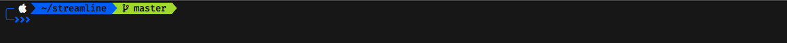

#### Streamline
> A theme for [Oh My Fish][omf-link].

[](/LICENSE)
[](https://fishshell.com)
[](https://www.github.com/oh-my-fish/oh-my-fish)

<br/>

Inspired by the ZSH theme [Powerlevel9k](https://github.com/bhilburn/powerlevel9k)

## Install

```fish
$ omf install https://github.com/juanrgon/streamline
```


## Default Prompt

<p align="center">

</p>


## Customizable

## Builtin Segments

#### streamline_os_icon_segment

Icon of the current OS

```sh
function streamline_os_icon_segment
    set -l os_icon
    switch (uname)
        case Darwin
            set os_icon ''
        case Linux
            set os_icon ''
        case Windows_NT
            set os_icon ''
    end
    echo $os_icon
    echo black
    echo white
end
```

# License

[MIT][mit] © [Juan Gonzalez][author]


[mit]:            https://opensource.org/licenses/MIT
[author]:         https://github.com/{{USER}}
[omf-link]:       https://www.github.com/oh-my-fish/oh-my-fish

[license-badge]:  https://img.shields.io/badge/license-MIT-007EC7.svg?style=flat-square
